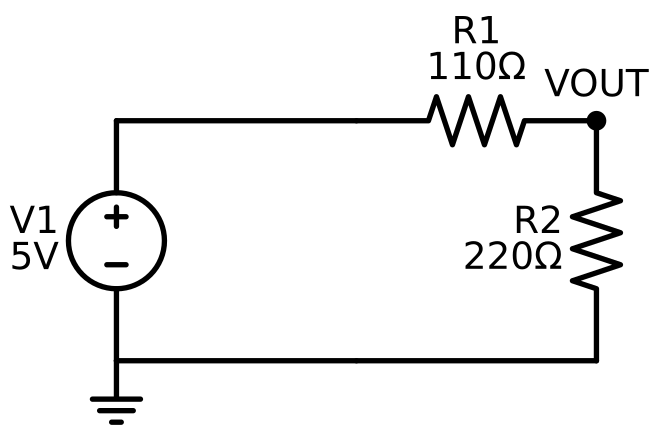
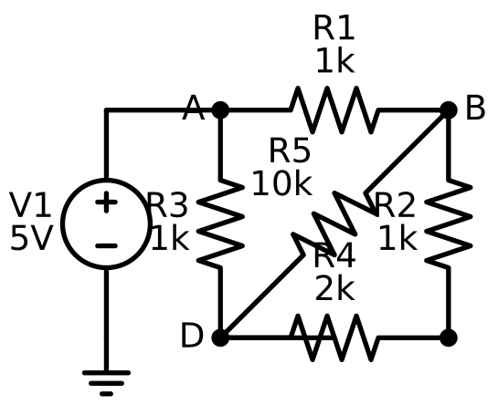

2026_07_26_15_01-(The-Solver-And-The-Draftsman)

# Lecture 008 — The Solver and the Draftsman: What It Takes to Make an Agent Design Circuits

You want plan 004. The pitch is: *describe an electrical product in natural language, and the agent builds the schematic, places and connects the components, simulates it, reads the results, and iterates until it works.*

This lecture is the thing you asked for before implementation starts: the concepts you need, the feasibility boundary, and an honest list of what this will and will not do. It is deliberately long, because the honest answer has two halves that pull in opposite directions and you need both:

> **The simulation half is far more feasible than it sounds. The drawing half is far less feasible than it sounds.** Most people's intuition has these exactly backwards — "running a physics simulation" sounds hard and "drawing a diagram" sounds easy. In this domain the reverse is true, and the reason *why* is the most valuable engineering lesson in the whole toolset.

Everything below earns that sentence.

**A note on evidence.** Every numerical claim in Parts 3–6 was verified by running code, not recalled. The sandbox this was written in had no `ngspice` binary available (no package-install privileges), so I did two things instead: built a Modified Nodal Analysis solver from scratch and ran it, and cross-checked against `ahkab`, a pure-Python SPICE-family simulator. Claims that depend specifically on ngspice's *own* behaviour are labelled **[unverified here]** and collected into a spike list in Part 12. That distinction matters — this document should not be the place you discover which claims were measured and which were assumed.

---

## Part 0 — The one-paragraph answer, then we earn it

A SPICE simulator is not a physics engine. It is a **sparse nonlinear equation solver wearing an electrical costume.** It takes a text file describing a graph, converts that graph into a matrix by a purely mechanical process, and then solves that matrix repeatedly — with Newton's method wrapped around it for nonlinearity, and numerical integration wrapped around *that* for time. Everything a circuit simulator does, and every way it fails, follows from those three nested loops. Because the input is text and the output is numbers, an LLM agent can drive it well: the interface is exactly the shape LLMs are good at. **Schematic drawing is a different problem entirely** — it is a graph *layout* problem, which is combinatorial, aesthetic, has no objective function, and is the reason every professional EDA tool still makes a human place the symbols by hand.

---

## Part 1 — Decomposing what you actually asked for

"Make electrical schematics, place and connect nodes and components, simulate, get dynamic feedback, iterate" is five separable capabilities. They have wildly different difficulty, and conflating them is how this project would blow its estimate.

| # | Capability | What it really is | Difficulty | Verdict |
|---|---|---|---|---|
| 1 | **Represent** a circuit the agent builds up call-by-call | An in-memory labelled multigraph + a text serializer | **Low** | Solved by Part 2 |
| 2 | **Simulate** it | Shell out to a solver, parse numbers back | **Low–Medium** | Solved by Parts 3–7 |
| 3 | **Verify** results ("tests it") | Assertions over simulation output | **Low** | Solved, and it's the good part (Part 9) |
| 4 | **Iterate** on failure | An agent loop with a real oracle | **Low** (given 1–3) | The actual differentiator (Part 9) |
| 5 | **Draw** a human-readable schematic | Graph layout + symbol placement + wire routing | **High, unbounded** | Constrained subset only (Part 8) |

Note the shape of that table. **Four of the five are easy and the fifth is a research topic.** The single most important scoping decision in plan 004 is refusing to let capability 5 hold the other four hostage.

There's a second observation worth making now, because it reframes the whole project. Compare this to your voxel toolset (plan 003):

| | Voxel (003) | SPICE (004) |
|---|---|---|
| Agent produces | Block coordinates | Component values + topology |
| Correctness oracle | **A human looking at the viewer** | **A simulator returning numbers** |
| Feedback loop | Open — the agent can't see its own build | **Closed — the agent reads results and adjusts** |
| Failure mode | Ugly castle | Numerically wrong, *detectably* |

Lecture 007 ended on the claim that *"most reliability is in the scaffolding you build, and the master lever is: what verifier can I wrap around it?"* The voxel viewer was a verifier for **you**. A SPICE simulator is a verifier for **the agent** — it's machine-readable, it's objective, and the agent can consume it mid-task without a human in the loop. That is a categorical upgrade, and it is the strongest argument for building this toolset at all. This is your first genuinely closed-loop agentic tool.

---

## Part 2 — The netlist: a graph that happens to be text

### 2.1 The character: **The Ledger**

Meet the first character. **The Ledger** is a flat, dumb, complete list of every component and what it touches. It has no idea what a circuit *does*. It knows only: *this part, these terminals, this value.* It doesn't know where anything sits on a page — there is no geometry in a netlist, and that omission is the seed of Part 8's entire problem.

A netlist is a **labelled multigraph**: nodes are electrical junctions, edges are components. Two facts make it a *multi*graph rather than a simple graph: two components can connect the same pair of nodes (a resistor in parallel with a capacitor), and components can have more than two terminals (a transistor has three, an op-amp five).

### 2.2 The format

```spice
* 5V to 3.3V resistive divider          <- line 1 is ALWAYS the title, never a component
V1 vin 0   dc 5
R1 vin vout 110
R2 vout 0  220
.op
.end
```

Rules that matter, all of them consequences of SPICE's 1970s punch-card heritage:

- **The first line is the title.** Not a comment — a *title*. If you emit a component on line 1, SPICE silently eats it. This is the single most common integration bug.
- **Node `0` is ground**, always, by definition. Every circuit must have one and every node must have a DC path to it (Part 3.5 explains why, and it isn't a style rule — it's linear algebra).
- **The first letter of the name selects the device model.** This is the whole type system:

| Letter | Device | Terminals |
|---|---|---|
| `R` `C` `L` | Resistor, capacitor, inductor | 2 |
| `V` `I` | Independent voltage / current source | 2 |
| `D` | Diode | 2 |
| `Q` `M` `J` | BJT, MOSFET, JFET | 3–4 |
| `E` `G` `F` `H` | Controlled sources (VCVS, VCCS, CCCS, CCVS) | 4 |
| `K` | Inductor coupling (transformers) | — |
| `X` | Subcircuit instance | any |

- **Case-insensitive**, whitespace-delimited, `*` starts a comment line, `+` continues the previous line.
- **Engineering suffixes**: `1k` = 1000, `1meg` = 10⁶ (**not** `1M` — `M` means *milli*, and this trips up everyone at least once), `1u` = 10⁻⁶, `1n`, `1p`, `1f`. Trailing letters after a valid suffix are ignored, so `10kohm` parses as 10000.
- **Dot commands** (`.op`, `.tran`, `.ac`, `.dc`, `.model`, `.subckt`, `.end`) are directives, not components.

### 2.3 Why this is good news for you

Emitting this from a C# object model is **pure string formatting**. No library, no parser, no dependency:

```csharp
public abstract record Component(string RefDes, IReadOnlyList<string> Nodes)
{
    public abstract string ToSpiceLine();
}

public sealed record Resistor(string RefDes, string A, string B, double Ohms)
    : Component(RefDes, [A, B])
{
    public override string ToSpiceLine() =>
        $"{RefDes} {A} {B} {Ohms.ToString("G6", CultureInfo.InvariantCulture)}";
}
```

> ⚠️ **`CultureInfo.InvariantCulture` is not optional here.** On a machine with a German or French locale, `double.ToString()` emits `1,5` for one-and-a-half. SPICE reads `1,5` as a mangled token and either errors or silently parses `1`. This is a real, shipped-to-production class of bug, and it's exactly the kind of thing your existing `Directory.Build.props` warnings-as-errors discipline won't catch for you. Every numeric format in the emitter needs `InvariantCulture`, and there should be a test that sets `CultureInfo.CurrentCulture` to `de-DE` and asserts the netlist is unchanged.

### 2.4 The uncomfortable truth: "SPICE format" is a family, not a standard

**[Verified]** I wrote the divider netlist above in textbook SPICE syntax and fed it to `ahkab`. It rejected it:

```
E: Parse error on line 2:  v1 vin 0 dc 5
NetlistParseError: parse_elem_vsource(): unknown type dc
```

`ahkab` wanted `V1 vin 0 type=vdc vdc=5`. Same circuit, same family, incompatible grammar. Berkeley SPICE3, ngspice, LTspice, PSpice, HSPICE, Xyce, and ahkab all read "SPICE netlists" and all disagree at the edges — `.tran` parameter order, `.model` parameter names, expression syntax, `.include` resolution, and especially source specifications.

**The design consequence is concrete:** do not build "a SPICE netlist emitter." Build **an ngspice emitter** — one target dialect, named in an ADR, with a test suite pinned to it. If a second backend ever matters, that's a `ISpiceDialect` interface and a second implementation, not a rewrite. Pretending to be dialect-neutral without a second backend to prove it is the "abstract from imagination" failure your ADR-003 and ADR-009 already warned you about, wearing a new hat.

---

## Part 3 — How a simulator actually solves a circuit: Modified Nodal Analysis

This is the conceptual core. If you understand this section you will understand every error message ngspice ever gives you, which is the difference between a toolset that surfaces `"simulation failed"` to the agent and one that surfaces `"node VOUT has no DC path to ground; add a resistor or set .ic"`.

### 3.1 The character: **The Solver**

**The Solver** is a bookkeeper with exactly one skill: it can solve `A·x = z` — a system of linear equations. It knows nothing about electricity. Everything a circuit simulator does is a scheme for repeatedly translating "a circuit" into a matrix `A` and a vector `z` that this bookkeeper can grind through.

### 3.2 The physics, which is two laws

- **Kirchhoff's Current Law (KCL):** the currents flowing into any node sum to zero. (Charge doesn't pile up.)
- **Ohm's Law**, generalized: each component relates the current through it to the voltage across it.

Nodal Analysis says: pick ground as the reference (0 V), let the unknowns be *the voltage at every other node*, write KCL at each of those nodes, solve. For a network of resistors and current sources, that's it — the whole method.

### 3.3 Stamping: how a graph becomes a matrix mechanically

Here's the part that feels like magic the first time and like bookkeeping forever after. You never "derive the equations." You walk the component list once and **add** a fixed pattern of numbers into the matrix for each one. This is called *stamping*, and it's why simulators are fast and why the code is short.

A resistor of conductance `g = 1/R` between nodes `a` and `b` contributes:

```
        col a    col b
row a  [  +g      -g  ]
row b  [  -g      +g  ]
```

That's the entire resistor model. Read it as KCL: current leaving node `a` toward `b` is `g·(Va − Vb)`, so `Va`'s equation gets `+g·Va − g·Vb`. If a terminal is ground, you just skip that row and column — ground's voltage isn't an unknown.

```csharp
static void StampResistor(double[,] A, int a, int b, double ohms)
{
    double g = 1.0 / ohms;
    if (a >= 0) A[a, a] += g;
    if (b >= 0) A[b, b] += g;
    if (a >= 0 && b >= 0) { A[a, b] -= g; A[b, a] -= g; }
}
```

Note `+=`, never `=`. Components accumulate. Ten resistors on one node just add their conductances into the same cell — which is exactly the physics of parallel resistors, falling out of the data structure for free.

### 3.4 The "Modified" part: why voltage sources break plain nodal analysis

Plain nodal analysis has a hole. A resistor tells you *current as a function of voltage*, which is what a KCL row needs. An **ideal voltage source doesn't**: it fixes its voltage and lets the current be whatever it needs to be. There's no `g` to stamp — mathematically the conductance is infinite.

**Modified** Nodal Analysis (Ho, Ruehli & Brennan, 1975) fixes this with a trick worth internalizing because it generalizes far beyond circuits: **when a variable is over-constrained, promote the constraint to a first-class unknown.** MNA adds one extra unknown — *the current through the voltage source* — and one extra equation — *the voltage across it equals V*.

So the matrix gets bordered:

```
      ┌─────────┬─────┐  ┌───┐     ┌───┐
      │    G    │  B  │  │ v │     │ i │      G = conductances (n×n, symmetric)
      │ (n × n) │(n×m)│  │   │  =  │   │      B = ±1 incidence of sources
      ├─────────┼─────┤  ├───┤     ├───┤      C = Bᵀ (for independent sources)
      │    C    │  D  │  │ j │     │ e │      D = 0
      │ (m × n) │(m×m)│  │   │     │   │      v = node voltages, j = source currents
      └─────────┴─────┘  └───┘     └───┘
```

Two things follow immediately, and both matter in practice:

1. **The matrix is no longer symmetric positive-definite** — the `D` block is zero, so there are zeros on the diagonal. You cannot use Cholesky; you need LU with pivoting. This is why every SPICE ships a sparse LU solver (Berkeley's `sparse1.3`; ngspice can also use `KLU`, a solver built specifically for circuit-simulation sparsity patterns).
2. **Adding a voltage source grows the matrix.** A circuit with many ideal sources is a bigger solve than its node count suggests.

### 3.5 Verified: the divider, end to end

**[Verified]** I stamped the 5V→3.3V divider by hand into a 3×3 MNA system and solved it:

```
A =                                        z =
[  0.00909091  -0.00909091   1.0 ]        [ 0 ]      unknowns: [ V(vin), V(vout), I(V1) ]
[ -0.00909091   0.01363636   0.0 ]        [ 0 ]
[  1.0          0.0          0.0 ]        [ 5 ]

solution:  V(vin) = 5.000000   V(vout) = 3.333333   I(V1) = -0.015151515 A
cond(A) = 7.368e+01
```

Cross-checked against `ahkab` on the same circuit: `VVOUT = 3.33333 V`, `I(V1) = -0.0151515 A`. **Exact agreement**, and it matches the worked example plan 004 §2.7 predicted. Read the matrix and confirm you can see it: row 0 is `(1/110)(Vin − Vout) + I(V1) = 0`, row 1 is `(1/110)(Vout − Vin) + (1/220)Vout = 0`, row 2 is `Vin = 5`.

Also note `cond(A) = 74` — a well-conditioned matrix. Hold that number; it becomes the diagnostic in the next section.

### 3.6 Verified: the two classic errors are both *"the matrix is singular"*

Almost every confusing SPICE error is one linear-algebra fact in disguise: **the matrix has no unique solution.** Two ways to get there, and I reproduced both.

**(a) "No DC path to ground."** A node touched only by capacitors. In a DC operating-point analysis a capacitor is an *open circuit* and isn't stamped at all — so that node's row is **entirely zeros**:

```
cap-only node row: [0. 0. 0. 0.]   <- ALL ZEROS
det = 0.000e+00   rank = 3 of 4
  -> LinAlgError: Singular matrix
```

An all-zero row means "0 = 0" — infinitely many solutions, the node's voltage is undetermined. The physics is honest: a floating node genuinely has no defined DC voltage.

**The fix simulators use is `gmin`.** Every node gets a tiny conductance (default `1e-12` S, a 1 TΩ resistor) quietly added to ground. Verified:

```
gmin=1e-12 rescue: rank=4, V(node3)= 0.000e+00 V
```

Rank restored, unique solution, and 1 TΩ is electrically negligible in any real circuit. **This is a beautiful piece of engineering pragmatism and worth stealing as a pattern:** a physically-meaningless-but-numerically-essential regularization term that converts an ill-posed problem into a well-posed one. It's the same move as Tikhonov regularization in least-squares, or adding ε to a denominator. Notice also that it is a *silent* fix — SPICE will happily return `0 V` for a node whose voltage is genuinely undefined, which is why your `check_node_voltage` assertion tool (Part 9) earns its keep.

**(b) "Voltage source loop."** Two ideal sources across the same node pair — `V1 = 5` and `V2 = 3` both from node A to ground:

```
voltage-source loop: rank = 2 of 3, det = 0.000e+00
  -> LinAlgError: Singular matrix
```

Two identical rows asserting different values. Physically it's a contradiction (5 V and 3 V simultaneously); numerically it's rank deficiency. Same for a loop of ideal voltage sources, or an ideal source shorted by a wire. `gmin` does **not** rescue this one — and it shouldn't, because the circuit is genuinely wrong.

> **Carry this away:** singular-with-a-zero-row (fixable, add `gmin`) vs singular-with-duplicate-rows (a real design error, must be reported to the agent) are *different failures with different remedies*. A good toolset distinguishes them in the message it hands back. A lazy one says "simulation failed."

---

## Part 4 — Nonlinearity: Newton-Raphson, and why simulators fail to converge

Everything in Part 3 is linear. Real circuits contain diodes and transistors, whose current is *exponential* in voltage:

```
I_D = I_S · (e^(V_D / (n·V_T)) − 1)          V_T = kT/q ≈ 25.85 mV at 300 K
```

You cannot stamp an exponential into a linear matrix. So SPICE does the only thing available: **linearize, solve, repeat.**

### 4.1 The character: **The Guesser**

**The Guesser** is the outer loop. It picks a guess for every node voltage, asks "if the voltages were *this*, what straight-line resistor would behave like this diode right here?", hands that linear circuit to The Solver, gets a better guess back, and repeats until the guess stops changing. That's Newton-Raphson.

### 4.2 The companion model

At an operating point `V₀`, take the first two terms of the Taylor series:

```
I(V) ≈ I(V₀) + g_d·(V − V₀)          where g_d = dI/dV |_{V₀} = I_S/(n·V_T)·e^(V₀/(n·V_T))
     = g_d·V + (I(V₀) − g_d·V₀)
       └─────┘   └──────────────┘
       resistor   current source
```

So a diode at a given guess **becomes a resistor `g_d` in parallel with a current source `I_eq`** — both of which stamp trivially. Every nonlinear device in SPICE is handled this way: a *companion model* that reduces it to linear elements at the current guess. This is a genuinely lovely idea. The simulator has exactly one hammer (linear solve) and turns every nail into that shape.

Convergence when it works is **quadratic** — the number of correct digits roughly doubles per iteration. That's why a well-behaved circuit converges in 5–15 iterations regardless of size.

### 4.3 Verified: why raw Newton is not enough

**[Verified]** I ran a 1 kΩ resistor in series with a diode, comparing raw Newton against SPICE-style step limiting:

| Supply | Method | Result |
|---|---|---|
| 5 V | raw Newton | converged in **173** iterations, V_d = 0.6925 V |
| 5 V | pnjlim-style limiting (Δ ≤ 0.1 V) | converged in **12** iterations, V_d = 0.6925 V |
| 20 V | raw Newton | **OVERFLOW at iteration 2** (guess jumped to 20.00 V) |
| 20 V | pnjlim-style limiting | converged in **14** iterations, V_d = 0.7313 V |

Look at what happened. Starting from 0 V, the diode's conductance is nearly zero, so the first Newton step says "the diode is an open circuit, therefore the full supply appears across it" and lands the guess at the supply voltage. Then it tries to evaluate `exp(20 / 0.02585)`. IEEE-754 double precision overflows at `exp(709)`, i.e. **V_d > 18.33 V**. The matrix fills with `inf` and `NaN`, the solve is meaningless, and ngspice reports what looks like a mysterious message about convergence.

**This is *the* reason SPICE has a reputation for not converging.** The exponential is brutally stiff, and Newton's method — which is only guaranteed to converge *near* the root — gets thrown far away from the root on its first step.

### 4.4 The convergence aids, and why the agent needs to know they exist

Real simulators layer on heuristics. In rough order of how they're applied:

| Aid | What it does | Analogy |
|---|---|---|
| **Junction limiting** (`pnjlim`) | Clamps per-iteration voltage change across PN junctions | The 173 → 12 result above; a leash on an over-eager dog |
| **`gmin` stepping** | Solve with huge `gmin` (an easy problem), then shrink it toward `1e-12`, reusing each solution as the next guess | Homotopy: solve an easy problem and deform it into the hard one |
| **Source stepping** | Ramp all supplies from 0 to nominal, reusing each solution | Same idea, different knob |
| **`.nodeset` / `.ic`** | Human-supplied initial guess | Telling Newton where to start looking |
| **`reltol`/`abstol`/`vntol`** | Convergence tolerances (defaults `1e-3` / `1e-12` A / `1e-6` V) | How close is close enough |

> **Design implication, and it's a real one.** When ngspice reports non-convergence, that is **not** a "the tool broke" error to swallow. It is *diagnostic information the agent can act on* — and the agent has a genuine advantage here, because an LLM has read a great deal about SPICE convergence troubleshooting. A tool that returns `"non-convergence in operating point; consider .nodeset on node VOUT, or check for a floating node"` lets the agent actually retry intelligently. A tool that returns `"error"` makes the agent guess. This is the single highest-leverage piece of tool design in the whole toolset, and it's the direct descendant of the lesson your `VoxelTools` already applies — every string a tool returns is a prompt.

---

## Part 5 — Time: companion models again, plus numerical integration

Transient analysis (`.tran`) asks: what do the voltages do *over time*? Capacitors and inductors are now live, and their behaviour is a **differential** equation:

```
i_C = C · dv/dt          v_L = L · di/dt
```

The Solver still only does linear algebra. So SPICE discretizes time into steps and applies the same trick as Part 4: **replace the derivative with an algebraic approximation, producing another companion model.**

### 5.1 The character: **The Metronome**

**The Metronome** decides how far to step forward, converts every capacitor and inductor into a resistor-plus-source valid *for that one step*, hands the whole thing to The Guesser (who hands it to The Solver), and then judges whether the step was too big and needs redoing.

With Backward Euler, `dv/dt ≈ (v_n − v_{n−1}) / h`, so:

```
i_C = C·(v_n − v_{n−1})/h  =  (C/h)·v_n  −  (C/h)·v_{n−1}
                              └───────┘     └────────────┘
                              conductance    current source
                                             (history term)
```

A capacitor becomes a resistor of value `h/C` in parallel with a current source carrying the previous step's state. **Every element is linear again.** The nesting is now three deep:

```
for each timestep:                     <- The Metronome (integration)
    for each Newton iteration:         <- The Guesser  (linearization)
        solve A·x = z                  <- The Solver   (sparse LU)
```

Everything a simulator does happens inside those three loops. Runtime is `timesteps × newton_iters × cost_of_solve`, which is why a 1 ms transient with 1 ns resolution is expensive and an operating point is instant.

### 5.2 Verified: accuracy is a direct function of step size

**[Verified]** Backward Euler on an RC step response (R = 1 kΩ, C = 1 µF, τ = 1 ms), compared against the analytic `V(1 − e^(−t/τ))`:

| step `h` | steps per τ | computed | exact | error |
|---|---|---|---|---|
| 1e-5 | 100 | 4.965463 | 4.966310 | **0.017 %** |
| 1e-4 | 10 | 4.957407 | 4.966310 | **0.179 %** |
| 1e-3 | 1 | 4.843750 | 4.966310 | **2.468 %** |

Backward Euler is **first-order**: halve the step, halve the error. Ten points per time constant gives you sub-1% — a useful rule of thumb for choosing `.tran` parameters, and something the agent should be told in a tool description rather than left to guess.

### 5.3 Verified: stability is a different thing from accuracy, and it's the scarier one

**[Verified]** Same RC circuit, backward (implicit) Euler versus forward (explicit) Euler:

| `h/τ` | backward Euler | forward Euler | exact |
|---|---|---|---|
| 0.5 | 4.9985 (err 0.03%) | 5.0000 | 4.9998 |
| 1.0 | 4.9951 (err 0.09%) | 5.0000 | 4.9998 |
| 3.0 | 4.9805 (err 0.39%) | **−75.0000** | 5.0000 |

Forward Euler doesn't get *inaccurate* at `h/τ = 3` — it **explodes**, to a voltage that doesn't exist in a 5 V circuit and has the wrong sign. This is numerical instability, and it is qualitatively different from error: the answer isn't slightly off, it's garbage that grows without bound.

Backward Euler is **A-stable**: it stays bounded for any step size, on any stable circuit. That property — not accuracy — is why every SPICE uses implicit methods despite them requiring a matrix solve at every step. **This is the concept of *stiffness***: when a circuit contains both very fast and very slow dynamics (a 1 ns switching edge and a 1 s startup ramp), an explicit method is forced to take steps small enough for the *fastest* phenomenon even while simulating the slowest. Implicit methods aren't.

The methods you'll see in practice:

| Method | Order | Stability | Notes |
|---|---|---|---|
| Backward Euler | 1 | A-stable | Very robust, heavily damped, over-smooths sharp edges |
| **Trapezoidal** | 2 | A-stable | **SPICE's default.** More accurate, but can *ring* — produce fake oscillation at sharp transitions |
| Gear / BDF, order 2–6 | 2–6 | Stiffly stable | The cure for trapezoidal ringing; ngspice `.options method=gear` |

That trapezoidal ringing artifact is worth knowing about specifically because **it looks like a real circuit behaviour.** An agent that sees oscillation in a waveform and confidently reports "your circuit oscillates" may be reporting a numerical artifact of the integrator. Lecture 007's confident-error failure mode, in a new costume.

### 5.4 Adaptive timestepping and the most famous SPICE error

SPICE doesn't use a fixed `h`. It estimates the **Local Truncation Error** at each step — roughly, how much the solution curved compared to what the integrator assumed — and if the LTE exceeds tolerance, it **rejects the step, halves `h`, and retries.** When things are quiet it grows `h` back. This is why a transient simulation returns points at irregular time intervals, which in turn is why a naive results parser that assumes uniform sampling will be wrong.

And when `h` gets halved repeatedly and still can't meet tolerance, you get the error every SPICE user eventually meets:

```
Timestep too small; time = 1.234e-06, timestep = 1.0e-18: trouble with node "vout"
```

It reads like a solver bug. **It almost never is.** It means: at this instant, the circuit's behaviour is so violent that no achievable timestep resolves it. Usual causes are a genuine discontinuity (an ideal switch, a zero-rise-time pulse source), a device model driven outside its valid range, or a real instability. The named node is the useful part — pass it through to the agent verbatim.

---

## Part 6 — AC analysis: a different animal, and cheaper than you'd think

`.ac` (small-signal frequency response) is *not* "transient with a sine wave," and understanding why saves a great deal of confusion.

AC analysis: (1) computes the DC operating point, (2) **linearizes everything once** around that point, (3) replaces every capacitor with the complex impedance `1/(jωC)` and every inductor with `jωL`, and (4) solves the **complex-valued** matrix once per frequency point.

Consequences:

- **No Newton loop, no timestepping.** One complex linear solve per frequency. It's fast — a 1000-point sweep is trivial.
- **It is a *small-signal* result.** It tells you how the circuit responds to an infinitesimally small wiggle around the bias point. It says **nothing** about clipping, slew-rate limiting, saturation, or any large-signal behaviour. An amplifier that AC analysis says has 40 dB of flat gain may be a clipped square-wave generator at real input amplitudes.
- Results are complex: magnitude *and* phase. Bode plots, −3 dB cutoff, gain and phase margin all come from here.

> **A feasibility boundary the agent must be told about explicitly.** If a user asks "will this amplifier distort?", `.ac` cannot answer it — that requires `.tran` at realistic amplitude, or `.disto`. An agent that runs an AC sweep and reports "no distortion" is making a category error. This belongs in the `set_analysis` tool description, not in a README nobody reads.

---

## Part 7 — The ecosystem: ngspice, models, and where the walls are

### 7.1 The engine

**ngspice** is the standard open-source SPICE, descended from Berkeley SPICE3f5, actively maintained. **Latest release: version 46, March 2026.** Mixed BSD-style / GPL licensing (the Berkeley core is BSD-ish; some contributed parts are GPL — worth an actual look before you ship a container, since Tool_Box has a public GHCR image). Packaged for apt, brew, and choco.

Integration shape — **shell out to a process, do not bind the library.** Same instinct as your existing Node-sidecar reasoning, and it holds for a specific reason: `libngspice` is a shared library with **process-global state** and a history of being awkward to reset between runs. A crashed or non-converging simulation in a child process is a non-zero exit code; the same thing in-process can take your MCP server down with it. **Process isolation is the feature**, not the compromise.

```
Circuit (C# model)
   │ ToNgspiceNetlist()
   ▼
circuit.cir  (with a .control block ending in `wrdata results.csv v(vout) ...`)
   │ Process.Start("ngspice", "-b circuit.cir")   + timeout + kill
   ▼
results.csv  (flat columns) ─── trivial CSV parse ───► SimulationResult
```

### 7.2 Three ngspice specifics that will bite you

**[unverified here — no ngspice binary was available in this sandbox; these come from the v46 manual and mailing list, and belong in the spike list]**

1. **`.control` blocks do not auto-run in batch mode.** This is the trap. With `-b`, plain dot-analyses (`.tran`, `.ac`) execute automatically — but if you supply a `.control` section (which you must, to use `wrdata`), the analysis is *not* run unless the control block explicitly contains `run`. The failure mode is an empty or missing output file plus a message like `Error: plot must be a transient analysis`. Every emitted netlist needs `run` as the first line inside `.control`.

2. **`wrdata` is the reason this integration is easy.** ngspice's native output is the "rawfile" format — documented, binary-or-ASCII, and fiddly. `wrdata` instead dumps named vectors as **plain whitespace-delimited columns**. That converts "parse a simulator's proprietary output format" into "parse a CSV," which is the single biggest risk reduction available in this whole design. Note the format quirk: `wrdata` writes an *x-column per y-column* (time, v1, time, v2, ...) rather than one shared x-axis — verify the exact shape in the spike rather than assuming.

3. **`.meas` pushes measurement into the simulator, and you should use it.** ngspice can compute rise time, fall time, delay, min/max/peak-to-peak/RMS/average, and threshold-crossing times *inside* the simulation and print a single scalar:

   ```spice
   .meas tran trise TRIG v(out) VAL=0.5 RISE=1 TARG v(out) VAL=4.5 RISE=1
   .meas tran vmax MAX v(out)
   ```

   This is a **big deal for your `OutputLimiter` discipline.** Instead of returning 10,000 samples for the agent to reason over — which it will do badly and expensively — you return `trise = 2.31e-6`. The measurement happens where the data already is. That's the same instinct as `place_box` computing coordinates server-side rather than making the agent emit them: *push the computation to where it's cheap, hand the agent the conclusion.* Call-economy, applied to results instead of inputs.

### 7.3 Models: the hard boundary on "real components"

Simulating `R`, `C`, `L`, ideal sources, and generic diodes needs nothing extra. Simulating **a specific real part** — an LM358 op-amp, an IRF540 MOSFET — requires a **model**: either a `.model` line of fitted parameters or a `.subckt` macro-model, published by the manufacturer.

Here is the wall, and it's a real one:

> **Many manufacturers distribute SPICE models only in encrypted form**, locked to LTspice or PSpice (LTspice uses a custom DES variant; PSpice uses custom DES and AES-256 depending on mode). **ngspice cannot read them.** This is a deliberate IP-protection choice by the vendors, not a gap in ngspice.

So the honest capability boundary is:

- ✅ Generic/idealized parts, textbook models, and the substantial body of open unencrypted models — fine.
- ✅ Op-amps as ideal macro-models (a VCVS with a pole) — fine, and adequate for most teaching-level designs.
- ⚠️ Specific real parts — *only if* an unencrypted ngspice-compatible model exists and is bundled or fetched.
- ❌ Any part whose only published model is LTspice/PSpice-encrypted — **cannot be simulated in ngspice, at all.**

And a second, subtler boundary that matters more for an *LLM* driving this: **an agent will confidently invent `.model` parameter values.** It has seen thousands of `.model` lines in training data and will happily emit a plausible-looking `2N3904` model with wrong parameters. The simulation will run. The numbers will be wrong. Nothing will error. This is precisely Lecture 007's confident-error failure mode in a domain where the output *looks* authoritative because it has units and six significant figures.

**Mitigation, and it should be a hard design rule:** the toolset ships a **curated model library** and exposes `list_models()`. Component tools accept a *model name from that library*, not a free-text `.model` line. The agent may not author device physics. This is the same shape as `Materials.Validate(material)` in `VoxelTools` — a closed vocabulary the agent must choose from rather than invent — and it's the reason that pattern was worth establishing.

### 7.4 "Utilize other software if needed" — the surrounding landscape

You asked about this explicitly. Honest assessment of what's worth touching and what isn't:

| Tool | What it does | Verdict for this toolset |
|---|---|---|
| **ngspice** | The simulator | ✅ **Core dependency.** |
| **schemdraw** (Python, MIT) | Draws circuit symbols | ✅ Rendering sidecar — but read Part 8 first |
| **ScottPlot** (.NET) | Charting | ✅ Waveform PNGs, **no sidecar needed** — the data is already in-process |
| **Xyce** (Sandia, open) | Parallel/HPC SPICE | ❌ Overkill; different dialect |
| **KiCad** | Full EDA suite: schematic capture *and* PCB layout | ⚠️ Its `eeschema` file format is documented and writable, so you *could* emit a `.kicad_sch` the user opens in a real tool. **But KiCad's schematic files carry explicit x/y coordinates for every symbol** — so this does not dodge Part 8's layout problem, it just relocates it. Genuinely interesting as a v2. Note also that KiCad *embeds ngspice* for its own simulation, which is a useful sanity check that the architecture you're choosing is the one the professionals chose. |
| **PySpice** | Python ngspice wrapper | ❌ Wrong language, and you don't need the abstraction over a CSV |
| **Verilog/VHDL simulators** | Digital logic | ❌ Different universe — see Part 10 |

---

## Part 8 — The Draftsman: why drawing the schematic is the hard part

Now the honest half. Plan 004 §2.5 flagged this as "Medium–High" risk. **Having actually run it, I'd argue it's the only High risk in the project, and it's High for a structural reason rather than an implementation-effort reason.**

### 8.1 The character: **The Draftsman**

**The Draftsman** receives The Ledger's list — *"R1 connects VIN and VOUT"* — and must decide **where on a page R1 physically sits, which way it points, where its label goes, and what path the wire takes.** None of that information exists in the netlist. The Draftsman is not translating; **it is inventing information that was never there.** That is the entire problem in one sentence.

### 8.2 Verified: the tool is excellent and the tool is not the problem

**[Verified]** I installed `schemdraw` and rendered the divider. **58 ms**, 10.9 KB of clean SVG, publication-quality output — proper zig-zag resistor symbols, a correct battery-style source, a real ground symbol, labels placed sensibly. The subprocess-sidecar contract works exactly as plan 004 §2.9 hoped: C# emits a small JSON description, Python emits SVG.



But look carefully at what I actually supplied:

```python
{"elements":[
   {"type":"SourceV", "label":"V1\n5V", "dir":"up"},
   {"type":"Line",     "dir":"right"},
   {"type":"Resistor", "label":"R1\n110Ω", "dir":"right"},
   {"type":"Dot",      "label":"VOUT"},
   {"type":"Resistor", "label":"R2\n220Ω", "dir":"down"},
   ...
```

**I specified the order and a direction for every element.** schemdraw is a **turtle-graphics** library: each element starts where the last one ended and goes the way you tell it. It draws beautifully and it **solves none of the layout problem.** The layout problem is precisely: *given only "R1 connects VIN and VOUT", produce that `dir` list.*

### 8.3 Verified: the failure is immediate and it's ugly

**[Verified]** I rendered a Wheatstone bridge — five resistors, still trivially small, but **not a series chain**. It required explicit `push`/`pop` stack manipulation, named anchors, and `endpoints()` calls. And even hand-placed by a human who could see the output, the result is **bad**: R5's diagonal cuts through the middle of the figure, and three labels (`R3 1k`, `R5 10k`, `R4 2k`) collide with other elements.



That is the finding. **A human, with full visibility, deliberately placing five components, still produced a schematic an engineer would reject.** An automatic layout algorithm working from a graph alone will not do better.

Put the two images side by side. Same library, same 20 ms, five components instead of four — and the output falls off a cliff. The variable that changed is not size, it's **topology**: the divider is a series chain, the bridge has a cross-link. That single structural property is the boundary Part 8.5 builds the whole rendering strategy around.

### 8.4 Why this is structurally hard, not just fiddly

Four independent problems stacked on top of each other:

1. **Placement.** Assign 2D coordinates to nodes. This is graph drawing — and the standard quality objectives (minimize wire crossings, minimize total wire length) are individually **NP-hard**. Even *deciding* whether a graph can be drawn with zero crossings is a planarity test, and most interesting circuits are non-planar.
2. **Orientation.** Each component has 4+ rotations and 2 mirrorings. Combinatorial, and coupled to placement.
3. **Wire routing.** Orthogonal routing with obstacle avoidance — a pathfinding problem per net, where each routed wire becomes an obstacle for the next.
4. **Labels.** Every component needs a value label placed near it and not on top of anything. **Map-label placement is itself NP-hard.** My bridge failed on exactly this, and it's the problem people forget exists until they see the output.

And there is no objective function. "Correct" is easy to check; **"readable" is a human aesthetic judgment.** You cannot write a unit test for it, which means you cannot optimize against it, which means iteration is blind.

Layered on top: **engineers read schematics by convention, not just topology.** Power at the top, ground at the bottom, signal flowing left to right, feedback drawn above the amplifier. A topologically perfect schematic that violates these is *harder* to read than a hand-drawn sketch. These conventions are tacit, learned by apprenticeship, and not encoded anywhere a program can consult.

> **This is why KiCad, Altium, OrCAD, and every other professional tool — with decades of engineering and commercial pressure behind them — still make a human place the symbols.** It is not an oversight. Auto-layout of schematics is a genuinely open problem. (Note the contrast with **PCB auto-routing**, which *is* largely solved and shipping — because it has a crisp objective function: minimize length and vias subject to design rules, with no aesthetic component. Same industry, adjacent problem, opposite outcome. The presence of an objective function is the entire difference, and that's a transferable lesson well beyond EDA.)

### 8.5 What to actually do — three tiers, in the order you should build them

**Tier A — Topology-constrained rendering (build this, and it is genuinely enough).** Detect the circuit's structure from the graph and render only shapes you have templates for:

- **Series chain** → single left-to-right run. Renders beautifully, verified.
- **Ladder / parallel branches off a common rail** → power rail on top, ground rail on bottom, one vertical branch per parallel leg. This covers dividers, RC filters, LED limiters, decoupling — i.e. **most of what a natural-language request actually produces.**
- **Recognized composite** (`add_rc_lowpass` etc.) → **ships with a hand-authored layout template.** This is the highest-value trick available: the Tier-2 composite tools of plan 004 §2.3 already know their own shape, so they can carry their own drawing. Auto-layout only ever has to handle what wasn't built from a template.
- **Anything else** → **refuse, explicitly.** `render_schematic()` returns *"This topology (5 components, 2 cross-links) isn't one I can lay out readably. The netlist is at ./x.cir — open it in KiCad or LTspice."* An honest refusal is worth more than an unreadable image, both to the user and to the agent, which can then say something true.

**Tier B — Netlist-as-the-real-artifact.** Reframe what "the deliverable" is. **The `.cir` file is the durable, portable, professional output** — it opens in KiCad, LTspice, Xyce, and every other tool in the industry. The rendered schematic is a *convenience preview*. This reframing costs nothing and removes the entire project's dependence on solving an open research problem.

**Tier C — General auto-layout.** Explicitly deferred. Its own plan, its own Learning doc, force-directed or constraint-based placement plus orthogonal routing plus label de-confliction. Real depth, real interest, and completely wrong to fold into a v1 estimate.

Write Tier A's constraint into an ADR, the same way ADR-008 wrote down "unauthenticated, network-isolated" — **a real limitation, documented, not silently discovered by a user.**

### 8.6 The one that actually needs no sidecar

Worth contrasting deliberately: **waveform plots are easy and should be pure .NET.** By the time you're plotting, the data is already parsed numbers in your process. ScottPlot renders a PNG directly with no subprocess, no Python, no JSON contract, no cross-language failure mode. Knowing *which* rendering need justifies a sidecar and which doesn't is itself a design judgment worth demonstrating — and the two live side by side in this one toolset, which makes it a genuinely good interview story.

---

## Part 9 — The agent loop: where this stops being a wrapper and becomes agentic

### 9.1 Call economy, again

Lecture 007 and `VoxelTools` already taught this: don't expose `add_node`/`add_wire` as the only primitives. That's `place_block(x,y,z)` five thousand times, in circuit form. Two tiers:

- **Tier 1 — primitives:** `add_resistor`, `add_capacitor`, `add_inductor`, `add_voltage_source`, `add_current_source`, `add_diode`, `add_transistor`, `add_opamp`.
- **Tier 2 — composites that expand server-side:** `add_voltage_divider(in, out, ratio, total_ohms)`, `add_rc_lowpass(in, out, cutoff_hz)`, `add_led_current_limiter(supply_v, led_vf, target_ma)`, `add_decoupling(rail)`.

Tier 2 is what makes "describe it and sit back" work. **And it does something Tier 2 in the voxel toolset couldn't:** it puts the *engineering* server-side. `add_rc_lowpass(cutoff_hz: 1000)` computes `R` and `C` from `f = 1/(2πRC)` in C#, deterministically, correctly, every time — instead of asking a language model to do arithmetic and hoping. **Every formula you move into a Tier 2 tool is a class of confident-error you have permanently eliminated.** That framing is worth stating in the plan explicitly, because it converts "composite tools save calls" (a performance argument) into "composite tools are the correctness boundary" (an architecture argument), and the second one is much stronger.

Two more that don't fit the tiers:

- **`describe_circuit()`** — the analogue of `describe_world()`. The agent cannot see the schematic; this is its only proprioception. It should report components, values, node connectivity, and — critically — **detected problems** (floating nodes, missing ground, unconnected terminals) *before* the agent burns a simulation on a circuit that can't solve.
- **A netlist escape hatch, deliberately omitted from v1.** A `run_raw_netlist(text)` tool would be trivially easy and would collapse the entire design into "LLM writes SPICE." It's tempting and it's wrong for v1: it discards the closed model vocabulary (§7.3), the server-side formulas (above), and every validation you built. It also turns the toolset into an arbitrary-file-execution surface. Worth naming in an ADR as a considered-and-rejected option so a future reader knows it wasn't overlooked.

### 9.2 The loop that makes this worth building

```
create_circuit("led_driver")
add_voltage_source("V1", "VCC", "0", kind: dc, volts: 5)
add_led_current_limiter(supply: "VCC", led_node: "LED_A", target_ma: 20)   # Tier 2
describe_circuit()                          -> "3 components, 3 nodes, all grounded, OK"
set_analysis(kind: operating_point)
run_simulation()                            -> converged in 7 iterations
check_current("D1", expect_between: [0.018, 0.022])
      -> FAIL: 0.0243 A, above the 0.022 A limit
add_resistor(...)  /  adjust R1             # the agent reads the failure and reacts
run_simulation()
check_current("D1", expect_between: [0.018, 0.022])   -> PASS (0.0201 A)
render_schematic()   -> schematic.svg
export_netlist()     -> led_driver.cir
```

**That `FAIL` line is the whole point of the toolset.** It's an objective, machine-readable, mid-task correctness signal — something the voxel toolset structurally could not provide. Lecture 007 argued the master lever is *"what verifier can I wrap around it?"*; here the verifier is a numerical solver, and it's inside the loop.

Which means `check_node_voltage` / `check_current` are **not** convenience helpers. They are the mechanism that turns a tool-wrapper into an agent, and they should be designed first, not bolted on. Their descriptions should tell the agent to call them — the same "descriptions are prompts" discipline your `DescriptionConventionTests` already enforce.

### 9.3 Where LLMs are strong and weak here, specifically

Straight from Lecture 007's framework — LLMs fit where *output is cheap to verify, error is cheap to make, and the task is pattern-saturated*:

**Strong:** mapping natural language to canonical topologies (the space of "circuits people describe in English" is small and pattern-saturated); recognizing which composite applies; reading simulation results and reasoning about what to change; interpreting ngspice error messages (heavily represented in training data).

**Weak:** arithmetic (→ push it into Tier 2 tools); inventing device model parameters (→ closed model library, §7.3); anything requiring visual inspection of a schematic; **judging whether a result is physically sensible** — the agent will not notice that a "working" design dissipates 40 W in a quarter-watt resistor unless something tells it. That last one argues for automatic sanity checks in `run_simulation()`'s summary: component power dissipation, node voltages outside the supply rails, currents above sane limits. **ngspice has `.options` SOA (Safe Operating Area) warnings that do some of this for you** — cheap to enable, and exactly the sort of guardrail the agent won't build for itself.

---

## Part 10 — The feasibility verdict

### ✅ Will work well

| Capability | Confidence |
|---|---|
| Build R/L/C/source/diode circuits from natural language | High |
| Emit valid ngspice netlists | High — pure string formatting |
| DC operating point, DC sweep, transient, AC sweep | High — this is ngspice's core competence |
| Read results back and assert on them | High — `wrdata` CSV + `.meas` |
| **Iterate: simulate → check → adjust → re-simulate** | High — **the strongest feature** |
| Waveform plots (ScottPlot, in-process) | High |
| Schematics for series/ladder/template topologies | **Medium-High — with Tier A constraints** |
| Export `.cir` that opens in KiCad/LTspice | High |
| Textbook analog blocks: dividers, RC/RL filters, rectifiers, LED limiters, single-stage amps, 555 timing, common op-amp configurations | High |

### ⚠️ Will work with caveats

| Capability | Caveat |
|---|---|
| Real named components | Only if an unencrypted ngspice model exists (§7.3) |
| Op-amp circuits | Ideal macro-models fine; real part behaviour needs a real model |
| Transistor circuits | Generic models fine; biasing may need `.nodeset` help |
| Larger circuits (20+ components) | Convergence risk grows; layout falls off a cliff first |
| Distinguishing numerical artifacts from real behaviour | Trapezoidal ringing (§5.3) looks like real oscillation |

### ❌ Will not work — say so up front

| Not possible | Why |
|---|---|
| **Arbitrary-topology pretty schematics** | Open research problem (Part 8) |
| **Encrypted vendor models** | Cryptographically locked to LTspice/PSpice |
| **PCB layout, gerbers, DRC** | Entirely different tool class (KiCad `pcbnew`) |
| **Digital / HDL simulation** | Verilog/VHDL is a different universe; SPICE is analog |
| **Thermal, EMC/EMI, mechanical** | Multi-physics; SPICE models none of it |
| **Parasitics of a real board** | Trace inductance/capacitance come from a *layout* that doesn't exist yet |
| **Component sourcing, cost, availability** | Not simulation — that's a distributor-API problem |
| **Safety certification for mains circuits** | Do not let the tool imply otherwise |
| **"Is this manufacturable?"** | Requires DFM knowledge SPICE has no access to |

> **The honest one-liner for the README:** *"Designs, simulates, and verifies small analog circuits, and exports industry-standard SPICE netlists. It is not an EDA suite: no PCB layout, no digital logic, no manufacturability analysis, and schematic rendering is limited to constrained topologies."*

---

## Part 11 — Architecture sketch and where the risk sits

```
┌─────────────────────────────────────────────────────────────┐
│ ToolBox.Spice  (toolset library, ADR-005 shape)             │
│                                                              │
│  SpiceTools.cs          [McpServerToolType] — the prompts    │
│  Circuit.cs             the in-memory graph (The Ledger)     │
│  NetlistEmitter.cs      Circuit -> ngspice text (Invariant!) │
│  Composites.cs          Tier 2 — the formulas live HERE      │
│  ModelLibrary.cs        closed vocabulary (cf. Materials.cs) │
│  NgspiceRunner.cs       Process.Start + timeout + kill       │
│  ResultParser.cs        wrdata CSV + .meas scalars           │
│  SimulationResult.cs    parsed numerics                      │
│  WaveformRenderer.cs    ScottPlot, in-process, no sidecar    │
│  SchematicRenderer.cs   topology detect -> schemdraw sidecar │
│                                 -> or an honest refusal      │
└─────────────────────────────────────────────────────────────┘
      needs in the image:  ngspice, python3, schemdraw
```

Fits your existing conventions cleanly: `AddSpiceToolset()` per ADR-005; a `Circuit` singleton per ADR-009's precedent (with the same "one client, one process" caveat written down); `OutputLimiter` on every return; stderr-only logging; optionally a viewer companion service per ADR-010 if you want live schematic updates in a browser.

**Risk, re-scored after the spikes:**

| Piece | Effort | Risk | Change from plan 004 §2.8 |
|---|---|---|---|
| Circuit model + netlist emission | S | Low | Unchanged — but add the `InvariantCulture` test |
| ngspice process + CSV | S–M | Low–Med | Unchanged; `.control`-needs-`run` is a known trap now |
| Tier 1 + Tier 2 tools | M | Low | **Reframed** — this is the correctness boundary, not just call economy |
| Model library | S | Low | **New line item** — §7.3, wasn't in the original table |
| Waveform PNG (ScottPlot) | S | Low | Unchanged |
| Schematic SVG | M | **High** | **Raised from Med-High.** Bridge render is the evidence |
| Result assertions (`check_*`) | S | Low | **Promote to first-class** — it's the agentic core |
| Docker/CI | S | Low | Unchanged |

The one meaningful change to plan 004's own estimate: **schematic rendering moves from "scope it hard" to "constrain it by topology, template the composites, and build an explicit refusal path."** Everything else in that plan survived contact with the spikes intact, which is a good sign for the design work already done.

---

## Part 12 — Spikes to run before Stage 3

The three from plan 004 §2.9, updated with what's now known:

1. ~~**schemdraw via subprocess**~~ — **✅ done.** Works, 58 ms, clean SVG. But the finding is that the sidecar was never the risk; *layout* is. Replace this spike with: **"pick five circuits a user would plausibly ask for, and hand-classify which of Tier A's templates each falls into."** If fewer than four are covered, Part 8's scope needs rethinking before Stage 3, not during it.
2. **ngspice batch + `wrdata` round-trip** — **still open, now the top-priority spike** since it couldn't be run here. Specifically confirm: `.control` requires `run` in `-b` mode; the exact `wrdata` column layout (repeated x-columns?); exit code on non-convergence vs. on a parse error; whether errors land on stdout or stderr; and behaviour on a deliberately singular circuit. Do it on the dev machine *and* inside the container — package versions differ.
3. **Rich content from `[McpServerTool]`** — **✅ resolved by documentation.** The C# SDK maps return types automatically: `string` → text, `ContentBlock` → one block, `IEnumerable<ContentBlock>` → several, `CallToolResult` → returned as-is. Images use `ImageContentBlock.FromBytes(bytes, "image/png")`:

   ```csharp
   [McpServerTool(Name = "render_schematic")]
   [Description("...")]
   public IEnumerable<ContentBlock> RenderSchematic() =>
   [
       new TextContentBlock { Text = "Schematic for divider_5v_to_3v3:" },
       ImageContentBlock.FromBytes(pngBytes, "image/png"),
   ];
   ```

   One caveat worth a spike of its own: there is an open csharp-sdk issue about `EmbeddedResourceBlock` not rendering in Claude Desktop, so **verify `ImageContentBlock` specifically in the client you'll demo in** before building a feature on it.

Plus two new ones the spikes surfaced:

4. **Locale test.** Run the netlist emitter under `de-DE` and assert byte-identical output (§2.3).
5. **Timeout and kill.** Feed ngspice a deliberately non-converging circuit and confirm your `Process` wrapper kills it and returns a useful message rather than hanging the MCP server. This is the one that turns into an incident if it's skipped.

---

## Part 13 — What to carry away

1. **A SPICE simulator is a sparse nonlinear equation solver in an electrical costume.** Three nested loops: timestep → Newton iteration → linear solve. Every capability and every failure mode follows from that structure.
2. **Stamping turns a graph into a matrix mechanically.** No equation derivation, ever — walk the component list and accumulate. That's why simulators are short and fast.
3. **Almost every SPICE error is "the matrix is singular."** Zero row → floating node → `gmin` fixes it. Duplicate rows → source conflict → genuinely broken. **Verified both.** Distinguishing them in your error messages is what separates a good toolset from a wrapper.
4. **Convergence failures are Newton's method getting thrown away from the root by an exponential.** Verified: 173 iterations vs 12 with limiting, and hard overflow at 20 V. Non-convergence is *diagnostic data for the agent*, not an error to swallow.
5. **Stability ≠ accuracy.** Verified: forward Euler produced −75 V in a 5 V circuit. This is why every SPICE uses implicit integration, and why `h/τ ≈ 0.1` is a rule worth telling the agent.
6. **The simulation is easy and the drawing is hard** — and the reason is that *drawing invents information the netlist never contained*, with no objective function to optimize against. PCB auto-routing is solved; schematic auto-layout isn't; the difference is entirely the presence of a crisp objective. **That contrast is the best generalizable lesson in this toolset.**
7. **This is your first closed-loop agentic tool.** The voxel toolset needed a human to judge the output. This one has a numerical oracle the *agent* can consult mid-task. `check_node_voltage` is the architecture, not a helper.
8. **Every formula pushed into a Tier 2 composite is a class of hallucination permanently eliminated.** Closed vocabularies (`ModelLibrary`, like `Materials`) do the same for device physics. The correctness strategy is *narrow the space of things the model is allowed to invent* — and that's the same conclusion Lecture 007 reached from the other direction.

### Interview relevance

This toolset generates unusually good stories, and they're the *systems* kind rather than the *feature* kind:

- **"Which rendering needs a sidecar and which doesn't"** — waveforms in-process with ScottPlot, schematics via a Python subprocess, and a written-down reason for each. That's an architecture judgment call with two live examples in one codebase.
- **"Why we shell out instead of linking the library"** — process isolation as a *feature* when the dependency has global state and can crash.
- **"Why we scoped schematic rendering to a subset and shipped an explicit refusal"** — recognizing an open research problem and routing around it is a senior behaviour; grinding on it for three weeks is not.
- **"How we stopped the model from inventing physics"** — closed vocabularies and server-side formulas, i.e. constraining a probabilistic component with deterministic scaffolding. This is the AI-engineering question, and you'd have a concrete answer.
- **"The agent verifies its own work against a numerical oracle"** — closed-loop agentic design with an objective correctness signal. Directly on-target for the AI-engineering roles you're aiming at.

### Where this leads next

- **Numerical methods** — sparse LU, Markowitz pivoting, condition number as a diagnostic. Part 3.5's `cond(A) = 74` is a thread worth pulling; ill-conditioning is the quiet failure mode between "works" and "singular."
- **Graph layout algorithms** — if Tier C ever happens, force-directed placement and orthogonal routing are a genuinely deep, genuinely fun area, and they connect to graph theory you'd see in interviews anyway.
- **Process supervision** — timeouts, cancellation, kill trees, resource limits on child processes. Spike #5 is the shallow end of a topic that shows up in every real backend system.
- **Your own domain advantage.** Per `persona.md`, you do embedded C/C++, Raspberry Pi, I²C/SPI, and hardware/software integration for a living. **You are one of a very small number of people building MCP toolsets who can actually evaluate whether a simulated circuit is sensible.** Most people building agent tooling could not tell a working LED driver from one that cooks the LED. That's not a side note — it's the reason this toolset is a differentiated portfolio piece rather than another wrapper, and it's worth saying out loud in the README and the YouTube video.

---

## Appendix — The verification code

Everything claimed as **[Verified]** came from these, run in the session that produced this document. Reproduce or extend them before Stage 3 if you want to see the machinery move.

**A.1 — MNA stamping and solve** (Part 3.5): builds the divider's 3×3 augmented matrix by stamping, solves with `numpy.linalg.solve`, cross-checks `ahkab`.

**A.2 — Singular matrices** (Part 3.6): a capacitor-only node producing an all-zero row (`rank 3 of 4`), rescued by `gmin = 1e-12`; two parallel voltage sources producing rank deficiency that `gmin` correctly does *not* rescue.

**A.3 — Newton-Raphson** (Part 4.3): series R + diode, `Is=1e-14`, `VT=0.025852`. Raw vs. 0.1 V-limited steps, at 5 V and 20 V supplies. Overflow threshold `VT × 709 = 18.33 V`.

**A.4 — Integration** (Parts 5.2, 5.3): backward Euler vs. forward Euler vs. analytic on an RC step, swept over `h/τ`.

**A.5 — Rendering** (Part 8): `schemdraw` divider (58 ms, 10.9 KB SVG) and Wheatstone bridge (hand-placed, three label collisions, one diagonal cutting the figure).

---

## Sources

- [Ngspice User's Manual, version 46](https://ngspice.sourceforge.io/docs/ngspice-html-manual/manual.xhtml) — batch mode, `wrdata`, `.meas`, `.options`, SOA warnings
- [Ngspice release news](https://ngspice.sourceforge.io/news.html) — v46, March 2026
- [ngspice manual — Analyses and Output Control (batch mode)](https://nmg.gitlab.io/ngspice-manual/analysesandoutputcontrol_batchmode.html)
- [ngspice manual — Trig/Targ (`.meas`)](https://nmg.gitlab.io/ngspice-manual/analysesandoutputcontrol_batchmode/measurementsafterac,dcandtransientanalysis/trigtarg.html)
- [ngspice mailing list — batch mode and the `.control` section](https://sourceforge.net/p/ngspice/mailman/message/31155106/)
- [Spice models and model parameters for ngspice](https://ngspice.sourceforge.io/modelparams.html)
- [A Copy-Paste Bug That Broke PSpice AES-256 Encryption](https://jtsylve.blog/post/2026/03/18/PSpice-Encryption-Weakness) — vendor model encryption modes
- [TI E2E — note on encrypted models and cross-simulator import](https://e2e.ti.com/support/tools/simulation-hardware-system-design-tools-group/sim-hw-system-design/f/simulation-hardware-system-design-tools-forum/692613/faq-tina-spice-note-about-encrypted-models-and-importing-models-from-one-simulator-to-another)
- [MCP C# SDK — Tools](https://csharp.sdk.modelcontextprotocol.io/concepts/tools/tools.html) — return-type mapping, `ImageContentBlock.FromBytes`
- [MCP C# SDK — CallToolResult](https://csharp.sdk.modelcontextprotocol.io/api/ModelContextProtocol.Protocol.CallToolResult.html)
- [csharp-sdk issue #1261 — EmbeddedResourceBlock and Claude Desktop](https://github.com/modelcontextprotocol/csharp-sdk/issues/1261)
- [schemdraw documentation](https://schemdraw.readthedocs.io/)
